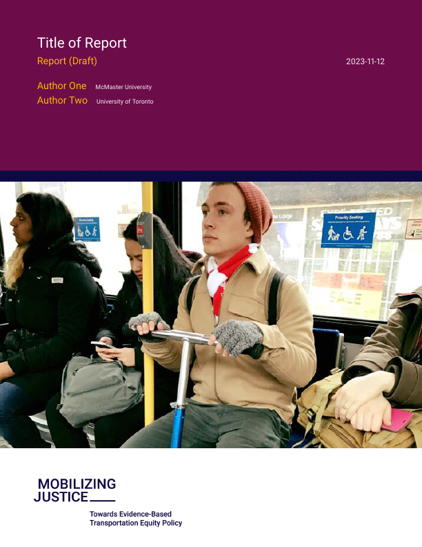

<!-- README.md is generated from README.Rmd. Please edit that file -->

# Mobilizing Justice Document Template

<!-- badges: start -->
<!-- badges: end -->

This template can be used to create documents for project Mobilizing
Justice

To create a new article using this format:

``` bash
quarto use template paezha/mj-report
```

This will install the extension and create an example qmd file that you
can use as a starting place for your document.

## Using the template

*TODO*: Describe how to use your format.

- Where do images go? Recommendations about the use of images.
- Where does the bibliography go?

## Format Options

*TODO*: If your format has options that can be set via document
metadata, describe them.

## Example

Below is an example of a document created using this template:

<!-- pdftools::pdf_convert('template.pdf',pages = 1) -->



The source code for this [minimal sample document]((template.qmd)) is
here

## License

*TODO*: What license to use??

This modifies the {Owner} {What} Template, available at \<{some_link}\>.
The original template is licensed under the
[{license_name}](%7Blicense_link%7D).
{any_other_required_notes_about_modifications}

## Acknowledgments

Christopher T. Kenneys’ post on creation of [quarto
templates](%5Bhttps://christophertkenny.com/posts/2023-07-01-creating-quarto-journal-articles/%5D)
was extremely valuable as we learned the task.
